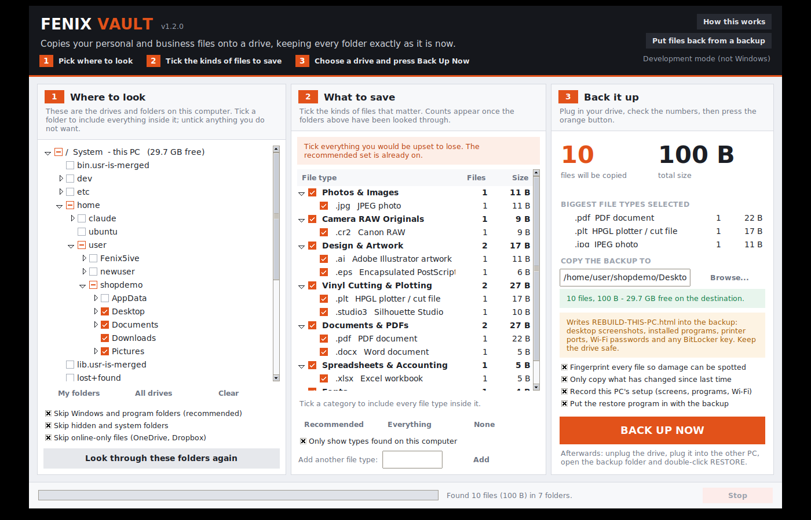
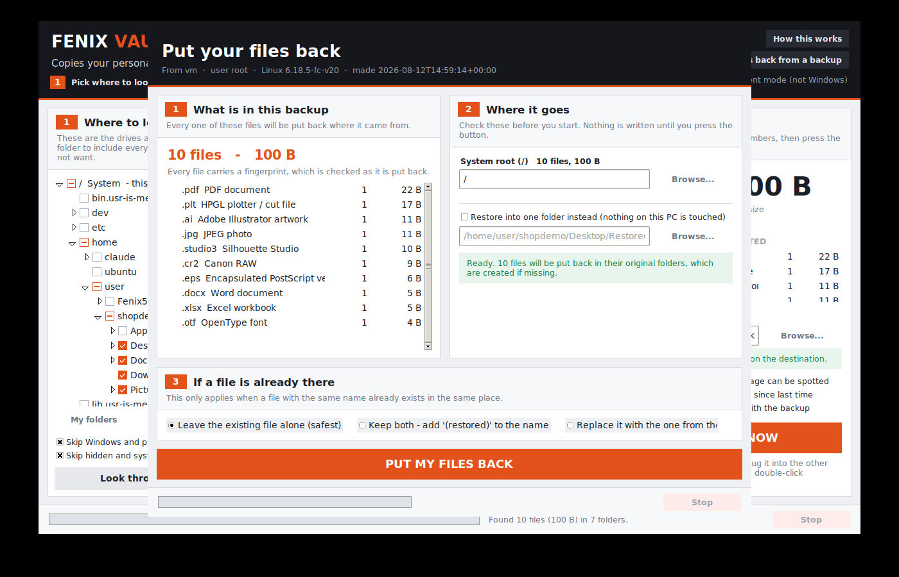
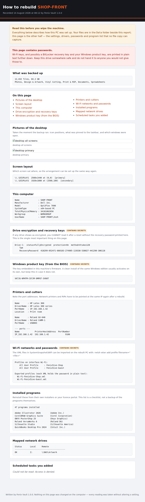

# Fenix Vault

A backup program for Windows that copies **your work** — not Windows, not your
installed programs — onto any drive you plug in, keeping the folder structure
exactly as it is. Carry that drive to another PC, double-click one file, and
every folder is rebuilt and every file goes back where it came from.

Built for a sign and vinyl shop, so it understands Illustrator files, cut files,
print files, embroidery stitch files and QuickBooks data alongside the usual
photos and documents.



## The three columns

| | |
|---|---|
| **1 — Where to look** | Every attached drive and the folders inside it. Tick a folder to include everything in it; untick a folder inside a ticked one to leave just that part out. The tick box goes half-filled to show a folder is only partly included. |
| **2 — What to save** | File types grouped into plain categories, each showing **how many files you actually have and how much space they take**, so the decision is made with real numbers rather than guesses. |
| **3 — Back it up** | The totals, the drive it is going to, a free-space check, and the button. |

## What makes it fit a real shop

**It reads what is installed on the PC.** On startup it looks through the
Windows registry's installed-program list. Find CorelDRAW, Silhouette Studio,
QuickBooks or embroidery software and the file types those programs create are
ticked automatically, with a note saying so.

**It cannot be defeated by a format nobody has heard of.** Every file extension
found during the scan that is not in the built-in catalog is surfaced under
*Other file types found on this PC*, labelled with the description Windows
itself uses for it, with a live count beside it. There is also a box to type in
any extension by hand. Between the three, nothing is invisible.

**It knows what is not worth copying.** Windows, Program Files, ProgramData,
`$Recycle.Bin`, browser caches, `node_modules`, temp folders — all skipped by
default. `AppData\Local` is skipped too, *except* the folders holding an
Outlook mailbox, OneNote notebooks and Thunderbird/Firefox profiles, which are
carved back in because they hold data that cannot be reinstalled.

**One stubborn file never stops the run.** A locked mailbox or an unreadable
folder is recorded in `backup-report.txt` and the copy carries on.

**It will not quietly download your cloud.** OneDrive and Dropbox show
online-only files that look ordinary but hold no data locally — opening one
downloads it. Copying a synced folder full of them would pull the entire cloud
account over your connection. Those files are skipped by default and listed in
`cloud-only-files.txt`, so nothing is missing without saying so. One tick
includes them if that is what you want.

## What a backup looks like

```
FenixVault-Backup-2026-08-12_1432\
├── HOW-TO-RESTORE.txt       plain-English instructions
├── RESTORE.exe              the program itself, ready to put it all back
├── REBUILD-THIS-PC.html     how this computer was set up
├── backup-info.json         where it came from, totals, settings used
├── manifest.jsonl           one line per file, with a SHA-256 fingerprint
├── backup-report.txt        only present if something could not be copied
├── cloud-only-files.txt     only present if files were left in OneDrive/Dropbox
├── SystemSnapshot\
│   ├── Screenshots\         one PNG per monitor, plus the whole desktop
│   ├── WiFi\                one XML per saved network, passwords included
│   ├── Registry\            exported preference keys, ready to double-click
│   └── Wallpaper\           the image that was on the desktop
└── Data\
    └── C\Users\Josh\Documents\Logos\logo.ai      ← the tree, mirrored exactly
```

Because the tree is mirrored rather than packed into an archive, you can also
just open `Data` and drag out a single file without running anything at all.

## Putting it back



Copy the backup folder to a USB or external drive, plug it into the other
computer, open the folder and double-click **RESTORE.exe**. Nothing needs to be
installed on that machine first — the backup carries the program with it, and
the program notices it is sitting inside a backup and opens straight into
restore mode.

It handles the two things that normally break a restore on a different PC:

- **Different user name.** `C:\Users\Josh\...` → `C:\Users\Bob\...`, offered as
  a one-click suggestion.
- **Missing drive letter.** If the files came off a `D:` that this PC does not
  have, it asks where to put them instead of guessing. Nothing is written until
  a destination is chosen.

Files already on the new PC are left alone by default. There is also
**Restore into one folder instead**, which rebuilds the whole tree inside a
folder you pick and touches nothing else — the cautious option.

## Two other things worth knowing

**Repeat backups are fast.** Point a second backup at the same folder and only
what has changed is copied; everything else is left in place. A weekly backup
takes a fraction of the time the first one did.

**Damage gets caught.** Each file is fingerprinted (SHA-256) as it is copied,
streaming, so it costs one read rather than two. The fingerprint is checked
again on restore, so a drive that has gone bad is reported by filename rather
than discovered years later.

## Wiping the PC and starting over

Files are only half of a rebuild. The other half is everything that lives
nowhere you can copy: which printer is on which IP, the Wi-Fi password nobody
has written down for years, the BitLocker key without which the old drive is a
brick.

With **Record this PC's setup** ticked, the backup also gets
`REBUILD-THIS-PC.html` — one page you can open on your phone while reinstalling
Windows:

- **Pictures of the desktop**, every monitor, exactly as it looked
- **Installed programs**, as a reinstall checklist
- **Printers and cutters** with their drivers and port addresses
- **Wi-Fi profiles**, exported so they can be imported on the new install
- **Drive encryption status and recovery keys**
- **Windows product key** from the machine's firmware
- Network adapters, mapped drives, startup items, services, scheduled tasks
- Screen layout, time zone, language, keyboard, power plan
- Fonts, wallpaper, what was on the Desktop
- Exported registry keys for Explorer and desktop preferences

Every reading is taken read-only; nothing on the machine is changed to collect
it. Screenshots use a PNG encoder written into the program, so there is still
no dependency to install.

> **That page can contain Wi-Fi passwords, a BitLocker recovery key and your
> Windows product key.** It says so at the top, in red. Keep the drive safe.



## Running it

### The easy way

Download **`FenixVault-Setup.exe`** from the **Actions** tab (the *Fenix Vault*
workflow, artifact `FenixVault-installer`). Double-click it, press Install, and
it opens the program when it finishes. It adds Start Menu and Desktop
shortcuts and an entry in Add/Remove Programs.

Windows will show a blue "Windows protected your PC" box, because the installer
is not code-signed — a certificate costs a few hundred a year. Click **More
info → Run anyway**. If you would rather skip the installer entirely, the
`FenixVault-windows` artifact is the bare `FenixVault.exe`: one file, nothing
to install, double-click it.

### Building it yourself

Install [Python](https://www.python.org/downloads/) (tick *Add Python to PATH*),
then double-click `build\build-windows.bat`. It runs the tests and leaves the
finished program at `dist\FenixVault.exe`.

For the installer as well, also install
[Inno Setup](https://jrsoftware.org/isdl.php) and run:

```
iscc installer\FenixVault.iss
```

which writes `installer\Output\FenixVault-Setup.exe`.

### From source

Python 3.10 or newer. Nothing to install — `tkinter` ships with Python on
Windows.

```
python FenixVault.py
```

### From the command line

For scheduled or scripted backups:

```
python FenixVault.py --no-gui --backup --to E:\Backups
python FenixVault.py --no-gui --backup --to E:\Backups --from "C:\Users\Josh\Documents" --categories design vinyl print
python FenixVault.py --no-gui --restore "E:\Backups\FenixVault-Backup-2026-08-12_1432"
python FenixVault.py --list-categories
```

## How the code is laid out

The engine never imports the interface, which is what lets the whole thing be
tested without a display.

| Module | Responsibility |
|---|---|
| `platformutil.py` | Drives, known folders, long paths, archive path mapping |
| `catalog.py` | The file types offered in the picker |
| `appdetect.py` | What is installed on this PC (Windows registry, read-only) |
| `selection.py` | Which folders are in or out, and what is never worth copying |
| `scanner.py` | Walking the tree and counting what is there |
| `manifest.py` | The on-disk record of a backup |
| `backup.py` | The copy engine |
| `restore.py` | The put-it-all-back engine |
| `payload.py` | Makes a backup folder able to restore itself |
| `pngwrite.py` | A small PNG encoder, so screenshots need no image library |
| `screengrab.py` | Desktop capture through GDI, across every monitor |
| `sysinfo.py` | How this PC is set up, gathered read-only |
| `report.py` | The rebuild page you read while reinstalling |
| `ui/` | The three-panel window, the restore window, the help window |

A few decisions worth explaining:

**Folder selection is a sparse rule set, not a flag per folder.** Ticking `C:\`
and unticking one folder inside it is two entries, not a million. Any path's
state is resolved by walking up to the nearest rule, which is what makes lazy
tree loading and whole-drive selection possible at the same time.

**The scan aggregates; it does not build a file list.** A busy shop PC holds a
million files. The copy re-walks the tree, which also means it copies what is on
disk at copy time rather than what was there when you started clicking.

**Every path goes through `\\?\` on Windows.** The classic 260-character limit
still bites, and a backup nests the original tree one level deeper — so paths
that were fine on the source machine cross the limit inside the backup.

**The manifest is JSON Lines.** It is appended as the copy runs, so a backup
interrupted by a power cut still leaves a readable record of everything that
made it, and restore can stream it instead of loading it all into memory.

## Tests

```
python -m unittest discover -s tests -v
```

59 tests covering the tri-state selection model, the exclude policy, archive
path mapping, catalog consistency, and full backup → delete → restore round
trips including user-profile remapping, conflict handling, incremental re-runs
and detection of a corrupted backup. They run on any platform.
